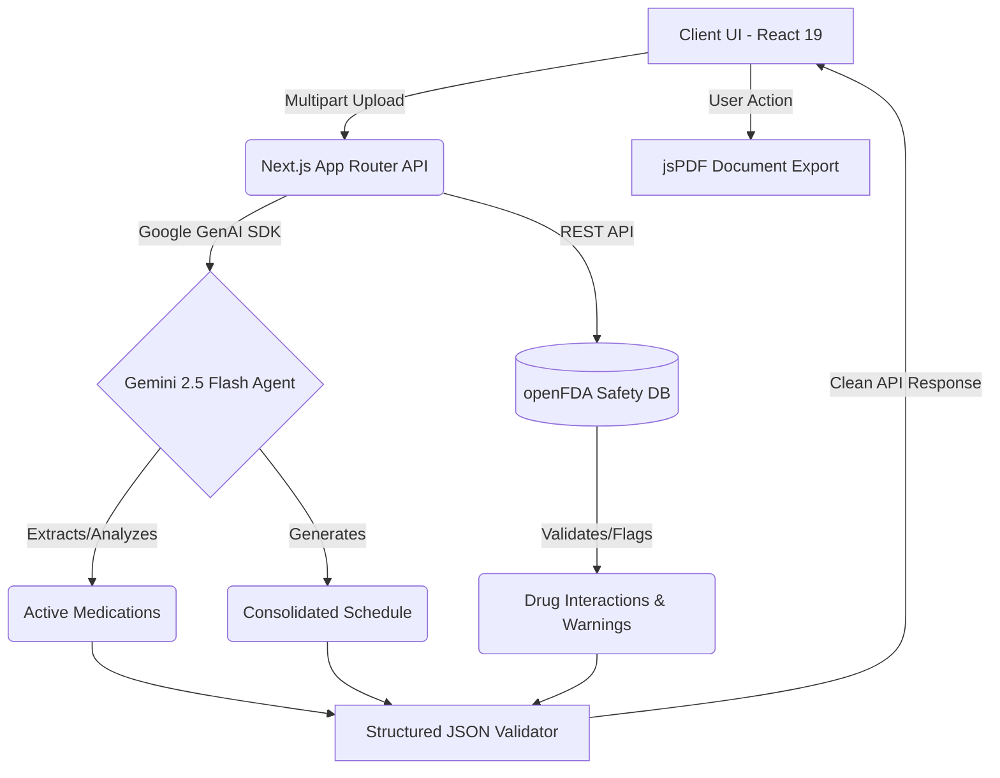
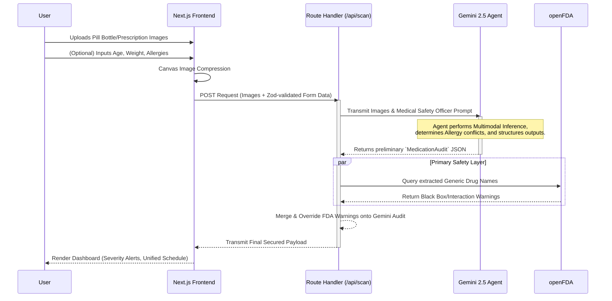

# 💊 PharmaCheck

> **Messy pill bottles + prescriptions → verified medication safety audit in under 30 seconds.**

PharmaCheck is a Gemini-powered multimodal AI application that lets caregivers and patients photograph any combination of pill bottles, prescription sheets, and pharmacy labels to generate a verified, conflict-free daily medication schedule.

---

## 🏢 1. Your Chosen Vertical

Built strictly for the **Promptwar 2026 Challenge** — Vertical: **Healthcare & Patient Safety**.

Polypharmacy (taking multiple medications) is a massive, often fatal safety risk. Caregivers for elderly parents or patients discharged from the hospital frequently receive conflicting, outdated, or hard-to-read prescription information scattered across multiple paper sheets and half-empty bottles. PharmaCheck operates entirely to solve this specific pain point by bringing an expert virtual pharmacist to anyone's smartphone.

---

## 🧠 2. Approach and Logic

PharmaCheck eschews traditional, slow OCR logic in favor of passing unadulterated image data directly to foundational multimodal models. Our approach centers on the concept of **"Zero-Trust AI Scheduling."**

1.  **AI as a Medical Safety Officer:** Instead of using the LLM for chat, we programmed Gemini to act as a strict regulatory officer. It is directed to logically halt scheduling and throw `Urgent` severity check flags if a user's context (like an uploaded Allergy constraint) cross-reacts with an active uploaded medication.
2.  **Contextual Reasoning over Extraction:** We don't just extract "Take generic Atorvastatin BID". The logic natively translates complex medical jargon into plain English context blocks (e.g. "Take your Lipitor (Atorvastatin) twice a day").
3.  **Strictly Guided Boundaries:** The backend strictly forces JSON-schema validation, trapping the LLM from outputting hallucinated prose, while Zod natively sanitizes user inputs (age/weight) on the backend to prevent malicious prompt injection strings.

---

## 🛠️ 3. How the Solution Works

1.  **Client Capture & Compression:** The user opens the web app on their phone or desktop and snaps photos of up to 20 pill bottles and medical sheets. The Next.js client uses an invisible HTML5 `<canvas>` to radically downscale and compress these huge images natively in the browser, saving ~80% network bandwidth.
2.  **Secure Payload Routing:** Images, along with optional (Zod-sanitized) patient age, weight, and allergy metadata, are sent via a Next.js App Router API. The API seamlessly hides all Gemini API keys behind the server, enforcing `Content-Security-Policy` protections. 
3.  **Multimodal Inference:** We use the `@google/genai` SDK to pipe the payload into **Gemini 2.5 Flash**. The Multimodal model reads every chaotic label, maps the active medications, and detects identical drug overlaps formatting it into a rigid `MedicationAudit` JSON interface.
4.  **OpenFDA External Verification:** In parallel, our Next.js API automatically pings the federal `api.fda.gov` endpoint with the extracted generic names to query for Black Box interaction warnings. This prevents hallucination by matching Gemini's claims against real, live government databases.
5.  **Rendering:** The user is instantly returned a Severity Alert Dashboard, a unified Morning/Night visual schedule grid, and a `jsPDF` button to export a printable document for their next doctor visit.

---

## ⚠️ 4. Any Assumptions Made

*   **Model Quotas:** We assumed standard GCP accounts might hit free-tier rate limits when uploading 20 images to `gemini-2.5-pro`, so the production logic leverages the high-throughput `gemini-2.5-flash` model which retains incredible OCR capabilities but operates with much higher free-tier quota limits.
*   **Target Device:** We assumed the primary user is an anxious, potentially non-tech-savvy caregiver using an average smartphone. As such, the frontend assumes touch inputs (large hit targets), limits deep navigation trees, natively supports 22 languages, and implements strict ARIA tagging for disabled users operating screen-readers.
*   **Infrastructure:** We assumed we needed to be completely portable for the Promptwar judges, so we bundled everything in a single `Next.js 16` codebase targeting `output: 'standalone'`, allowing it to execute locally or scale infinitely on Google Cloud Run.

---

## 📊 5. Full Architecture Diagram

### High-Level System Architecture

### Agent Logic Workflow

