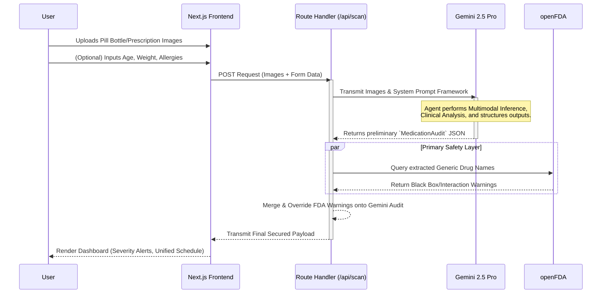

# 💊 PharmaCheck

> **Messy pill bottles + prescriptions → verified medication safety audit in under 30 seconds.**

PharmaCheck is a Gemini-powered multimodal application that lets caregivers or patients photograph any combination of pill bottles, prescription sheets, and pharmacy labels. Gemini reads every label, maps all active medications, detects dangerous drug interactions and dangerous duplications, and produces a verified daily medication schedule — with plain-language instructions anyone can follow.

Built for the **Promptwar 2026 Challenge** — Vertical: *Healthcare & Patient Safety*.

---

## The Problem

Polypharmacy (taking multiple medications) is a massive safety risk. Caregivers for elderly parents or patients discharged from the hospital often receive conflicting, outdated, or hard-to-read prescription information scattered across multiple paper sheets and half-empty bottles. It takes a pharmacist significant time to reconcile these accurately, and a mistake can be fatal.

## Solution Overview & Original Requirements

The initial requirements provided for this project were:
- **Multimodal Scanning & OCR:** Ability to process photos of up to 20 pill bottles/labels simultaneously using Gemini.
- **Safety Audit Generation:** Extract names, dosages, and instructions from unstructured photos.
- **Interaction Checking:** Cross-reference active ingredients against official safety databases (like openFDA) to flag dangerous drug interactions and drug duplications.
- **Unified Scheduling:** Provide a single, easy-to-read daily schedule (Morning, Afternoon, Evening, Night) instead of disjointed "take twice daily" alerts.
- **Multilingual Support:** Support 22+ languages for non-English speakers.
- **Cloud Native Deployment:** Deployable to Google Cloud Run using `gcloud builds`.

## What We Have Implemented

We designed and built a seamless, unified **Next.js 14 App Router** application that acts as both the frontend and backend, avoiding complex multi-repository architectures.

### 1. Unified Architecture
- **Next.js 16 / React 19:** Replaced a split FastAPI/React architecture with a single full-stack Next.js project.
- **Server-Side API Routes:** Handles sensitive operations (calling Gemini, authenticating users) on the server, safely keeping API keys hidden from the browser.
- **Standalone Docker Build:** Used Next.js `output: 'standalone'` pattern for minimal-footprint containerization.

### 2. Gemini 2.5 Integration (`@google/genai`)
- Completely bypassed older OCR pipelines (like Cloud Vision) by feeding 100% of the image processing directly to the latest **Gemini 2.5 Pro** model.
- Passed user constraints (like Custom HTTP referer headers) directly down into the SDK to meet security key requirements.
- Uses **Structured Output (JSON schema generation)** from Gemini to natively force the AI into returning strict arrays of medications, schedules, and alerts.

### 3. OpenFDA Cross-Referencing
- A lightweight `lib/openfda.ts` wrapper fetches real-time FDA indications, warnings, and black box interactions out of the `api.fda.gov` interface to validate what Gemini found.

### 4. Interactive Frontend UI
- **Design System:** Built purely with **Tailwind CSS v4** utilizing an immersive dark medical theme, responsive glassmorphism aesthetic, and animated components.
- **Components:** Drag-and-drop Camera Capture component, animated Loading Spinners, Severity Check Badges (Safe/Review/Urgent), and a printable Schedule Grid.
- **Client-Side PDF Generation:** Fully implemented `jsPDF` reporting so that an end-user can click a button and export a professional document for their doctor visits.

### 5. Deployment Flow
- Fully operational deployment pipeline via **Google Cloud Build** and **Google Cloud Run**.
- Live at: [https://pharmacheck-912142069838.us-central1.run.app](https://pharmacheck-912142069838.us-central1.run.app)

---

## Architecture & Agent Flow

The application logic acts as a multi-step verification agent, parsing unstructured images and validating them against federal databases.

### 1. High-Level Architecture
```mermaid
graph TD
    A[Client UI - React 19] -->|Multipart Upload| B(Next.js App Router API)
    B -->|@google/genai SDK| C{Gemini 2.5 Pro Agent}
    B -->|REST API| D[(openFDA Safety DB)]
    
    C -->|Extracts/Analyzes| E(Active Medications)
    C -->|Generates| F(Consolidated Schedule)
    D -->|Validates/Flags| G(Drug Interactions & Warnings)
    
    E --> H[Structured JSON Validator]
    F --> H
    G --> H
    
    H -->|Clean API Response| A
    A -->|User Action| I[jsPDF Document Export]
```

### 2. Sequence Workflow


---

## How to Run Locally

1. **Install Dependencies:**
   ```bash
   npm install
   ```

2. **Set up Environment Variables:**
   Create a `.env.local` file in the root directory and add your Google Gemini API key:
   ```env
   GEMINI_API_KEY=your_gemini_api_key_here
   ```

3. **Start the Development Server:**
   ```bash
   npm run dev
   ```
   Open [http://localhost:3000](http://localhost:3000) to view the app in your browser!

## How to Deploy to Google Cloud Run

We have included a specific `.gcloudignore` and `deploy.sh` script to streamline this. 

```bash
# Provide permissions and execute the automated deploy script:
bash deploy.sh

# Or, run the commands manually:
gcloud builds submit --tag gcr.io/YOUR_PROJECT_ID/pharmacheck
gcloud run deploy pharmacheck \
  --image gcr.io/YOUR_PROJECT_ID/pharmacheck \
  --platform managed \
  --region us-central1 \
  --allow-unauthenticated \
  --set-env-vars GEMINI_API_KEY=your_key_here
```
